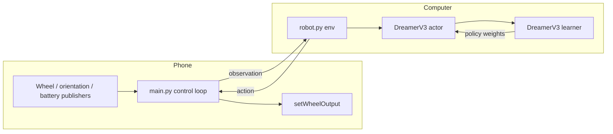

# DreamerV3 Bridge

`dreamerBridge` puts the robot in the training loop of a DreamerV3 agent that
runs on a computer. The phone is the environment: it applies the action it is
given, waits out the control period, and reports its sensors. Nothing is
learned on the phone.

The computer side is `embodied/envs/robot.py` in the
[dreamerv3](https://github.com/danijar/dreamerv3) checkout, which listens for
the phone and exposes it to DreamerV3 as an ordinary environment.

## Split Of Work



The phone owns the control clock, so the computer blocks between steps and the
two ends stay in lockstep. An action is applied exactly once.

## Prerequisites

- [Getting Started](getting-started.md), so `./app` works and the phone is
  visible to `adb`.
- A `dreamerv3` checkout on the computer, on the same network as the phone.

## 1. Point The App At The Computer

Copy `config.template.json` to `config.json` at the repository root and set the
computer's address. The file is ignored by Git, and its values are compiled
into `BuildConfig.IP` and `BuildConfig.PORT`:

```json
{
    "DEFAULT": {
        "ip": "192.168.1.23",
        "port": 3000
    }
}
```

Use the computer's LAN address, not `localhost`: it is resolved on the phone.

## 2. Start Training

On the computer, from the `dreamerv3` checkout:

```bash
.venv/bin/python -u dreamerv3/main.py \
  --logdir ~/logdir/$(date +%Y%m%dT%H%M%S) \
  --configs robot \
  --task robot_drive
```

Actor and learner run as separate processes and exchange policy weights
through the log directory, so training continues while the robot keeps moving.

## 3. Start The Robot

```bash
./app run --app dreamerBridge
```

Order does not matter. The phone retries until the trainer is listening, and
the trainer waits for the phone. If either side restarts mid-run the other
reconnects on its own; a drop mid-episode ends that episode rather than
failing the run.

The phone screen shows connection state, the last action, the step counter and
the measured control rate, which is what the trainer actually sees.

## Where To Customize

The control loop, sensor selection and wire format are in:

```text
apps/dreamerBridge/src/main/python/main.py
```

`CONTROL_HZ` there sets the control rate. Reward, episode length and the action
space live on the computer in `embodied/envs/robot.py`, so changing the task
does not mean rebuilding the app.

`MainActivity.kt` is Android wiring, and `abcvlib.py` is Chaquopy bridge code;
see [Python Demo Apps](python-demo-apps.md) for that split.

Chaquopy exposes Java and Kotlin *fields* as attributes but does not turn
getters and setters into properties, so Kotlin `var`s on `GuiUpdater` must be
written through `setX(...)`, not by attribute assignment. Assigning the
attribute raises `AttributeError` only once the app runs on the phone.

## Reward Calibration

Wheel speeds arrive in encoder units, not normalised: measured on the robot
they average about 600 and peak near 2400. `--env.robot.speed_scale` converts
them into reward units and defaults to `1e-3`, which puts per-step reward near
0.25 and peaks around 2. Recalibrate it if the gearing or encoder changes; a
first run whose `episode/score` is in the tens of thousands means it is wrong.

The wheel speeds in the *observation* stay raw, since the DreamerV3 encoder
applies symlog to vector inputs and handles that range on its own.

## Wire Format

One TCP connection, both directions framed the same way:

```text
[4 bytes big-endian: JSON header length]
[JSON header]
[blob_len bytes of binary payload]
```

The phone opens with `{"type": "hello", "protocol": 1, ...}` and the computer
answers in kind. After that the computer sends
`{"type": "act", "left": ..., "right": ..., "reset": ...}` and the phone
answers `{"type": "obs", "step": ..., "sensors": {...}}`.

`blob_len` is `0` today. The observation is proprioceptive only — wheel speeds,
tilt angle, angular velocity and battery voltage; the blob is where camera
frames go when vision is added.

## State And Action Space

The action is one of the five wheel presets `basicAssembler` uses (`stop`,
`forward`, `backward`, `left`, `right`), so a policy trained through the bridge
means the same thing if it is later moved on-device. Set
`--env.robot.discrete False` on the computer for continuous per-wheel PWM
instead.

See [Reinforcement Learning Applications](reinforcement-learning-applications.md)
for the full sensor tree the phone can publish.
